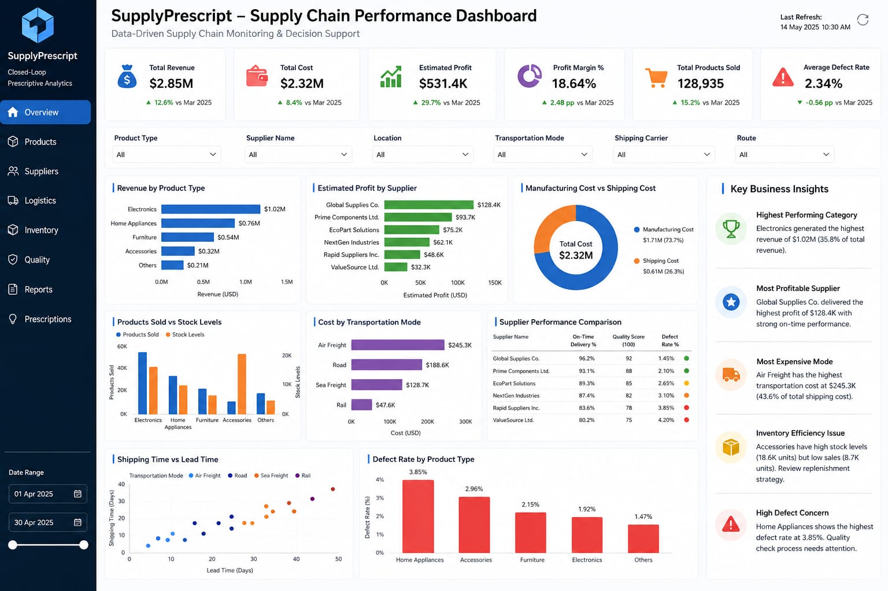

# SupplyPrescript-Data-Analysis
Data analysis and business insights for the SupplyPrescript project using Python and Jupyter Notebook.


# SupplyPrescript - Data Analysis

## 1. Project Overview

SupplyPrescript is a data analytics project focused on analyzing supply chain data and generating meaningful business insights.

This project uses Python and Jupyter Notebook to perform data loading, data cleaning, exploratory data analysis, feature engineering, correlation analysis, and business insights.

## 2. Objectives

- Analyze supply chain data
- Clean and prepare the dataset
- Understand important patterns and relationships
- Create meaningful features
- Identify correlations between variables
- Generate business insights
- Support better supply chain decision-making

## 3. Dataset

The project uses a supply chain dataset containing information about:

- Product type
- Price
- Availability
- Products sold
- Revenue generated
- Stock levels
- Lead times
- Order quantities
- Shipping times
- Shipping costs
- Suppliers
- Production volumes
- Manufacturing costs
- Defect rates
- Transportation modes
- Routes
- Other supply chain-related variables

## 4. Technologies Used

- Python
- Pandas
- NumPy
- Matplotlib
- Seaborn
- Scikit-learn
- XGBoost
- Jupyter Notebook
- GitHub

## 5. Project Workflow

The data analysis workflow is divided into separate Jupyter Notebooks.

### 01. Data Loading

File: `01_data_loading.ipynb`

Tasks:

- Import required libraries
- Load the dataset
- Display the first rows
- Check dataset information
- Check dataset shape
- Generate summary statistics

### 02. Data Cleaning

File: `02_data_cleaning.ipynb`

Tasks:

- Check missing values
- Check duplicate records
- Handle missing values
- Check data types
- Clean unnecessary data
- Prepare the dataset for analysis

### 03. Exploratory Data Analysis

File: `03_eda.ipynb`

Tasks:

- Analyze numerical variables
- Analyze categorical variables
- Study distributions
- Create charts and visualizations
- Identify important patterns and trends

### 04. Feature Engineering

File: `04_feature_engineering.ipynb`

Tasks:

- Create new meaningful features
- Calculate cost-related metrics
- Calculate efficiency metrics
- Prepare variables for further analysis

### 05. Correlation Analysis

File: `05_correlation_analysis.ipynb`

Tasks:

- Select numerical variables
- Calculate correlation
- Create a correlation matrix
- Generate a heatmap
- Identify important relationships between variables

### 06. Business Insights

File: `06_business_insights.ipynb`

Tasks:

- Analyze product performance
- Analyze supplier performance
- Analyze revenue and costs
- Analyze transportation-related factors
- Identify important business patterns
- Summarize actionable insights

## 6. Repository Structure

```text
SupplyPrescript-Data-Analysis/
│
├── 01_data_loading.ipynb
├── 02_data_cleaning.ipynb
├── 03_eda.ipynb
├── 04_feature_engineering.ipynb
├── 05_correlation_analysis.ipynb
├── 06_business_insights.ipynb
├── supply_chain_data (1).csv
├── requirements.txt
├── README.md
├── LICENSE
└── SupplyPrescript_Dashboard.pbix.jpeg
```

7. Power BI Dashboard

The final Power BI dashboard presents the key supply chain performance indicators, analytical charts, and business insights generated from the project.

### Dashboard KPIs

- Total Revenue
- Total Cost
- Estimated Profit
- Profit Margin %
- Total Products Sold
- Average Defect Rate

### Dashboard Visualizations

- Revenue by Product Type
- Estimated Profit by Supplier
- Manufacturing Cost vs Shipping Cost
- Products Sold vs Stock Levels
- Cost by Transportation Mode
- Supplier Performance Comparison
- Shipping Time vs Lead Time
- Defect Rate by Product Type

### Final Dashboard



